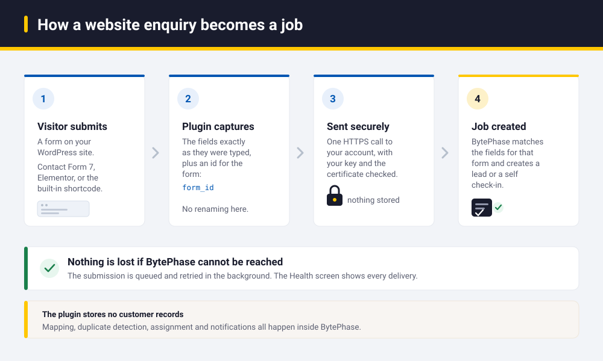
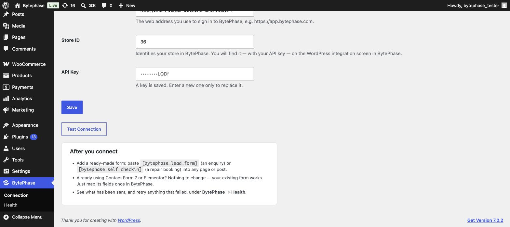
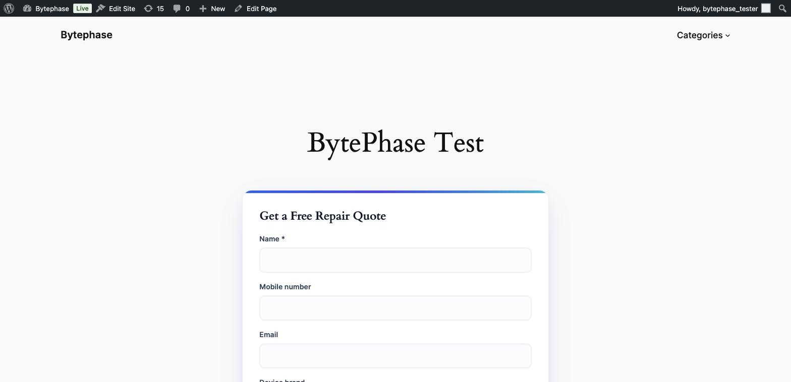
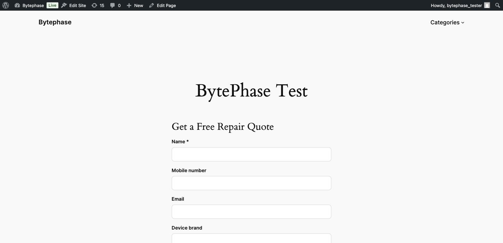
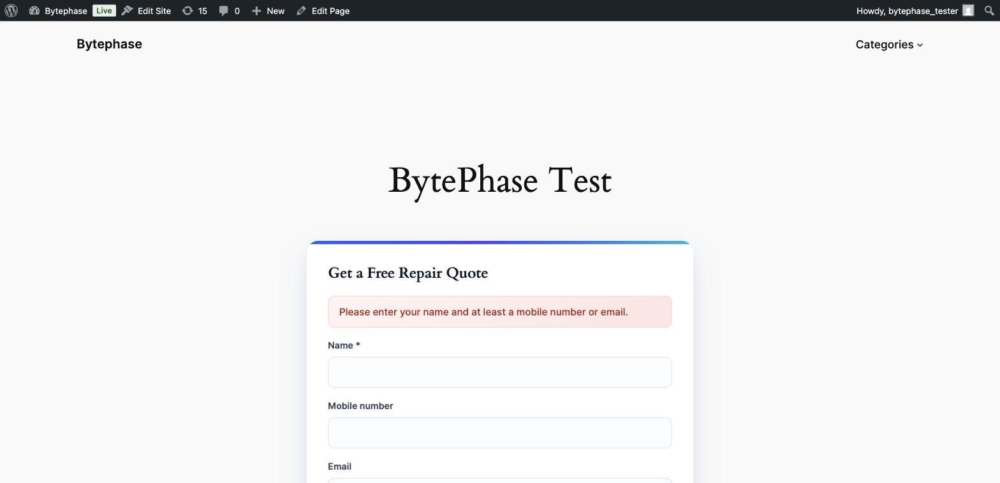
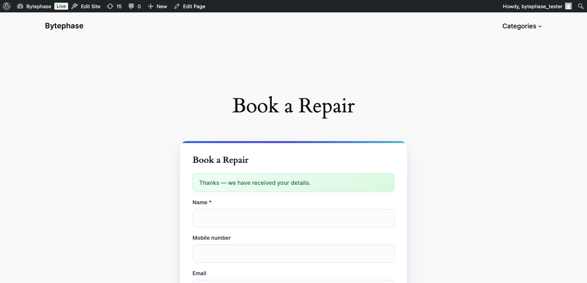
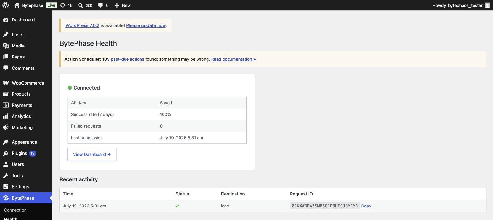
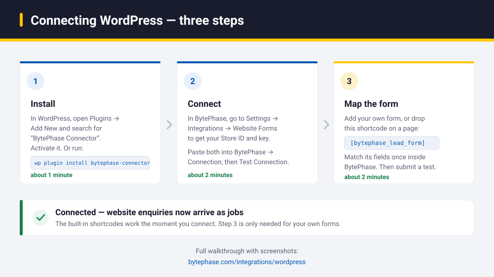
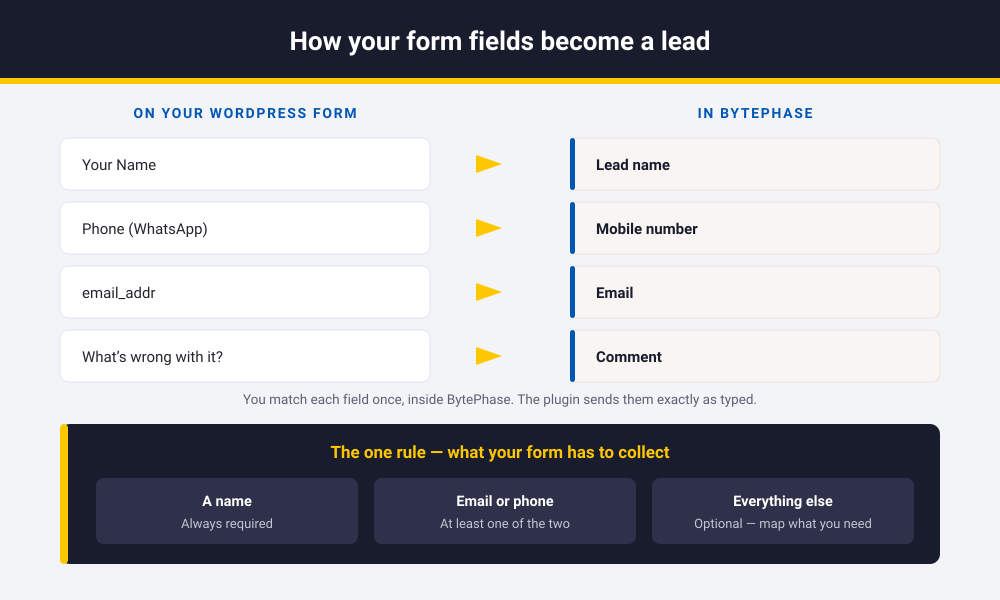

# BytePhase Connector (WordPress)

[](https://wordpress.org/plugins/bytephase-connector/)
[](https://wordpress.org/plugins/bytephase-connector/)
[](LICENSE)

A lightweight WordPress plugin that sends form submissions from a WordPress website into
**BytePhase** — the repair-shop management platform — as **Leads** or **Self Check-ins**.

Install it from the [WordPress plugin directory](https://wordpress.org/plugins/bytephase-connector/),
or read the [setup guide](https://bytephase.com/integrations/wordpress/).

It is a **dumb connector**: it captures the raw fields a visitor submitted plus a stable form
identifier and forwards them to BytePhase over an authenticated HTTPS call. **All** mapping,
validation, duplicate detection, assignment, notifications and CRM logic happen inside BytePhase.
The plugin holds no business logic and stores no customer data.

- **Stack:** PHP 8.2+, PSR-4 (`BytePhase\Connector\` → `src/`), Composer autoload with a bundled fallback.
- **Design doc:** [`docs/ARCHITECTURE.md`](docs/ARCHITECTURE.md) (the authoritative spec).

---

## Table of contents

1. [What it does](#1-what-it-does)
2. [How it works](#2-how-it-works)
3. [Screenshots](#3-screenshots)
4. [Requirements](#4-requirements)
5. [Installation & setup](#5-installation--setup)
6. [Using it — forms & connectors](#6-using-it--forms--connectors)
7. [Field mapping & the destination contract](#7-field-mapping--the-destination-contract)
8. [The BytePhase ingestion API](#8-the-bytephase-ingestion-api)
9. [Code map (architecture)](#9-code-map-architecture)
10. [Background delivery & retries](#10-background-delivery--retries)
11. [Health & monitoring](#11-health--monitoring)
12. [Security](#12-security)
13. [Development](#13-development)
14. [Testing](#14-testing)
15. [Troubleshooting](#15-troubleshooting)
16. [Release & publishing](#16-release--publishing)
17. [Roadmap / not yet built](#17-roadmap--not-yet-built)

[Help and links](#help-and-links) · [Setup guide on bytephase.com](https://bytephase.com/integrations/wordpress/)

---

## 1. What it does

A customer fills in a form on your website — a quote request, a repair booking, a contact form. Instead
of that enquiry sitting in an inbox, it arrives in BytePhase as a **Lead** or a **Self check-in**, ready
to work on.



In detail, when a visitor submits a form the plugin:

1. Captures the submitted fields **verbatim** (no renaming) plus a stable `form_id`.
2. POSTs them to BytePhase's ingestion endpoint with the store's API key.
3. BytePhase maps the raw fields to canonical fields, validates, deduplicates, and creates the record.
4. Records an operational log entry (status + request id) and retries transient failures.

**The philosophy:** the shop owner builds any form with any field names; BytePhase does the mapping.
The plugin never becomes a second CRM.

> New to this? The [step-by-step setup guide with screenshots](https://bytephase.com/integrations/wordpress/)
> on bytephase.com walks through the whole thing.

---

## 2. How it works

The same picture, in code terms — every form source funnels into one shared path:

```
 WordPress form (any builder, any field names)
        │
   ┌────▼──────────────┐   Connectors — extract raw fields + form_id
   │ Native form/block │   [bytephase_lead_form] / [bytephase_self_checkin]
   │ Generic hook      │   do_action('bytephase_submit_form', $submission)
   │ Contact Form 7    │   wpcf7_mail_sent
   │ Elementor Forms   │   elementor_pro/forms/new_record
   └────┬──────────────┘
        │  Submission { provider, form_id, destination?, data{raw}, meta }
   ┌────▼──────────────┐   Core (shared)
   │ Dispatcher        │   build envelope → POST once → log
   │ Retry queue       │   failures only, WP-Cron backoff
   │ Activity log      │   operational, capped, no business data
   └────┬──────────────┘
        │  POST /api/{store}/integrations/submit   (X-API-Key + X-Tenant)
        ▼
   BytePhase → maps raw→canonical → validates → dedups → creates Lead / Self Check-in
```

Every connector produces the **same** `Submission` object; everything after that is shared. Adding a
new form source is one class, no core changes.

---

## 3. Screenshots

**Connection settings** (with guided help)



**Native form** — the styled, self-contained card (loads CSS only on pages that use the shortcode)



**Configurable heading & button** via shortcode attributes



**Required-field enforcement** — rejected before it reaches BytePhase



**Self check-in** — creates a repair check-in (not a Lead), with serial number



**Health screen** — “did it leave WordPress, did BytePhase accept it, can I retry?”



---

## 4. Requirements

| | |
|---|---|
| WordPress | 6.0+ |
| PHP | **8.2+** (developed/tested against 8.2–8.4) |
| A BytePhase account | with the WordPress integration enabled (it provides the Store ID + API key) |
| HTTPS | the plugin refuses non-HTTPS BytePhase URLs and verifies SSL |

No PHP extensions beyond WordPress defaults. No `vendor/` needed at runtime (bundled autoloader).

---

## 5. Installation & setup

Three steps, about five minutes in total.



### 5.1 Install the plugin

**Option A — from the WordPress plugin directory (recommended):**
`wp-admin → Plugins → Add New Plugin → search “BytePhase Connector” → Install → Activate`, or run
`wp plugin install bytephase-connector --activate`.

**Option B — upload the zip:**
`wp-admin → Plugins → Add New Plugin → Upload Plugin → bytephase-connector.zip → Install → Activate`.

**Option C — copy the folder** into `wp-content/plugins/bytephase-connector/` and activate.

On first activation the plugin redirects you straight to the **Connection** screen, and adds a
**Connect** quick-link on the Plugins list.

### 5.2 Get your BytePhase details

You need three values from BytePhase:

| Field | What it is | Where to get it |
|---|---|---|
| **BytePhase Web Address** | the URL you sign in to BytePhase with | e.g. `https://app.bytephase.com` |
| **Store ID** | your tenant identifier (sent as the `X-Tenant` header) | BytePhase → Integrations → WordPress |
| **API Key** | the key issued for your WordPress integration (starts `bp_`) | BytePhase → Integrations → WordPress → generate key |

> **Local / dev note:** if both WordPress and BytePhase run in Docker on the same host, the Web Address
> must be a hostname the WordPress container can reach — a service name on a shared network, not
> `localhost`. See [Troubleshooting](#15-troubleshooting).

### 5.3 Connect

`wp-admin → BytePhase → Connection`:

1. Paste **Web Address**, **Store ID**, **API Key** → **Save**.
2. Click **Test Connection** → it should say *“Connected to BytePhase.”*
3. Add a form (below) and map its fields once in BytePhase.

The API key is stored write-only (masked, never shown again after saving, never logged).

---

## 6. Using it — forms & connectors

### 6.1 Native BytePhase form (zero-config)

Drop a shortcode into any page or post. Its fields are already canonical, so **no mapping is needed**.

```
[bytephase_lead_form]          → creates a Lead
[bytephase_self_checkin]       → creates a Self Check-in (adds a serial-number field)
```

**Attributes:**

| Attribute | Default | Purpose |
|---|---|---|
| `title` | “Send an enquiry” / “Book a repair” | Form heading. Use `title=""` to hide it. |
| `button` | “Submit” | Submit-button label. |

```
[bytephase_lead_form title="Get a Free Repair Quote" button="Send Request"]
[bytephase_self_checkin title="Book a Repair" button="Book Now"]
```

The native form enforces the required fields client-side of the API (name + at least one of
email/mobile) and shows a friendly message if incomplete — so a bad submission never reaches BytePhase.

**Custom fields.** Anything you have already created in BytePhase under *Settings → Custom fields* can
be shown on these forms. The plugin never defines a field: it reads the definitions (label, type,
options, required) from BytePhase and renders them, so a field is edited in one place.

Under **BytePhase → Forms → Custom fields**, each shortcode gets three choices:

| Choice | What it does |
|---|---|
| Show custom fields on this form | Off by default. Nothing renders until you turn it on. |
| Pull definitions from | Which form type to read — `Lead` for the enquiry form, `Self check-in` for the booking form, by default. |
| Which fields to publish | Tick the ones that belong on a public website. Required fields are always shown, because BytePhase rejects a submission without them. |

Definitions are cached for 12 hours; **Refresh** on that screen pulls them again straight away. If
BytePhase cannot be reached the form still renders — it simply shows no custom fields rather than
failing. Values are sent in the same shape the app writes, so they appear on the lead or the check-in
exactly like a field a staff member filled in.

### 6.2 Contact Form 7

Just build a CF7 form. On successful submit (`wpcf7_mail_sent`) the connector forwards the posted
fields (CF7 internal `_wpcf7*` fields are stripped) keyed by the **CF7 form id**. Map that form’s
fields once in BytePhase — nothing to configure in WordPress.

### 6.3 Elementor Pro Forms

Build an Elementor form. On `elementor_pro/forms/new_record` the connector forwards the field values
keyed by the **form name**. Map it once in BytePhase.

### 6.4 Generic hook (developers)

Any theme or plugin can feed BytePhase directly:

```php
do_action( 'bytephase_submit_form', [
    'form_id'     => 'contact-us',        // stable id BytePhase keys mapping + destination on
    'destination' => 'lead',              // optional: 'lead' | 'self_checkin'; resolved by form_id if omitted
    'data'        => [                     // raw field names exactly as authored; BytePhase maps them
        'customer_name'  => 'John',
        'customer_phone' => '9999999999',
    ],
] );
```

Need the result? Use the filter:

```php
$result = apply_filters( 'bytephase_submission', [
    'form_id' => 'contact-us',
    'data'    => [ 'name' => 'John', 'phone' => '9999999999' ],
] );
// $result = [ 'outcome' => 'created'|'duplicate'|..., 'status_code' => 201, 'request_id' => '01H…' ]
```

Register a brand-new connector without touching core:

```php
add_filter( 'bytephase_register_connectors', function ( array $connectors ) {
    $connectors[] = new My_Connector( /* BytePhase\Connector\Core\Dispatcher */ );
    return $connectors;
} );
```

---

## 7. Field mapping & the destination contract

This is the part worth understanding, because it is what keeps the plugin simple.

**You name your form fields whatever you like.** The plugin forwards them exactly as they are, along
with an identifier for the form. Inside BytePhase you match each field to a BytePhase field once, and
every future submission from that form follows the same route.



So the plugin **never maps fields**. For third-party forms (Contact Form 7, Elementor, the generic
hook), BytePhase does it, keyed by `form_id`. The built-in shortcodes already send BytePhase's own
field names, so they need no mapping at all.

Rename a field, restyle the form, or add a new one, and nothing in WordPress needs to change.

**The one rule — what a form must collect:**

| Field | Lead | Self Check-in |
|---|---|---|
| `name` | **required** (≤60) | **required** (≤255) |
| `email` **or** `mobile_number` | **at least one** | **at least one** |
| device / address / comment / source… | optional | optional |
| `serial_number`, `is_pickup_booked`, `custom_fields` | — | optional |

Every entry point must satisfy that set. The built-in form enforces it for you. For Contact Form 7 or
Elementor, your form has to collect a name and at least one of email or phone, and the mapping has to
point at them — otherwise BytePhase rejects the submission with a `422` and the Health screen shows it.
More detail: [`docs/ARCHITECTURE.md`](docs/ARCHITECTURE.md).

---

## 8. The BytePhase ingestion API

The single endpoint the plugin talks to.

| | |
|---|---|
| **Method / URL** | `POST {web_address}/api/{store_id}/integrations/submit` |
| **`X-API-Key`** | the integration API key (required) |
| **`X-Tenant`** | the Store ID — how BytePhase resolves the tenant (required; the `{store_id}` in the path is a route placeholder only) |
| **`Idempotency-Key`** | optional UUID; a replay returns the original result with `200` |
| **`Accept` / `Content-Type`** | `application/json` |

**Request body:**

```json
{
  "provider": "wordpress",
  "form_id": "contact-us",
  "destination": "lead",
  "data": { "name": "John", "mobile_number": "9999999999", "email": "john@example.com" }
}
```

- `provider` — source (`wordpress`, `cf7`, `elementor`).
- `form_id` — optional but recommended; BytePhase uses it to pick the field-map + destination.
- `destination` — optional; `lead` or `self_checkin`. Resolved from the form config if omitted.
- `data` — **raw** submitted fields, verbatim.

**Responses:**

| Code | Meaning | Plugin behaviour |
|---|---|---|
| `201 Created` | Lead / ContactUs created (entity returned) | success, logged |
| `200 OK` | duplicate → `{ "status":"duplicate", "data":{…} }` | success, logged |
| `401 Unauthorized` | missing / invalid / inactive / expired key, or bad tenant | stop; flip health to “Reconnect” |
| `422 Unprocessable` | validation failed `{ "message":…, "errors":{…} }` | terminal (not retried) |
| `429 Too Many Requests` | rate limited (60/min per integration) | queued + backoff |
| `5xx` / network | server/transport error | queued + backoff |

Every response carries an **`X-Request-Id`** (a ULID) that matches the `request_uuid` on the BytePhase
`form_submission` record — the plugin displays it on the Health screen for support/tracing.

**Example — create a lead (from inside the WordPress host):**

```bash
curl -X POST \
  -H "X-API-Key: bp_xxxxxxxxxxxxxxxx" \
  -H "X-Tenant: 36" \
  -H "Accept: application/json" \
  -H "Content-Type: application/json" \
  --data '{"provider":"wordpress","form_id":"native-lead","destination":"lead","data":{"name":"Jane","mobile_number":"9998887777"}}' \
  https://app.bytephase.com/api/36/integrations/submit
# → 201 Created, header: X-Request-Id: 01K…
```

**Connection test** (used by the Test Connection button): the plugin POSTs an **empty body**. A valid
key returns `422` (the Form Request rejects the empty payload *before* any submission is recorded — so
it never pollutes the log or failure counters); an invalid key returns `401`.

---

## 9. Code map (architecture)

```
bytephase-connector.php     WP entry: header + constants + PSR-4 autoload + boot
uninstall.php               remove options + cron + pending-submissions table
composer.json               BytePhase\Connector\ → src/ ; dev: phpunit, brain/monkey, phpcs, phpstan
src/
  Plugin.php                composition root; wires collaborators; cron; activation redirect
  Core/
    Submission.php          readonly value object (provider, formId, data, destination, meta)
    Envelope.php            Submission → canonical JSON body
    ApiResult.php           typed outcome classified from the HTTP response
    ApiClient.php           the one HTTP boundary (SSL verify, timeout, X-API-Key + X-Tenant)
    Dispatcher.php          send once → log → queue only on retryable failure; retry worker
    PendingSubmissions.php  failed-only custom table + WP-Cron backoff
    ActivityLog.php         capped operational log (last 50 / 30 days)
  Connectors/
    Connector.php           interface: slug(), isAvailable(), register()
    ConnectorRegistry.php   collects connectors via filter, boots the available ones
    GenericConnector.php    do_action / apply_filters public API
    Cf7Connector.php        Contact Form 7
    ElementorConnector.php  Elementor Pro Forms
    NativeConnector.php     shortcodes + form POST handler + styling
  Settings/
    Settings.php            connection data accessor (base url, tenant, submitUrl)
    Credentials.php         API-key storage (autoload=no, masked, never logged)
    SettingsPage.php        Connection screen + Test Connection
    HealthPage.php          Health screen + one-click retry
assets/native-form.css      scoped form styling (enqueued only on shortcode pages)
tests/                      PHPUnit + Brain Monkey unit suite
docs/                       ARCHITECTURE.md + screenshots
```

---

## 10. Background delivery & retries

- **Successful sends never touch a table** — they’re logged and done.
- **Only retryable failures** (`429` / `5xx` / network) are stored in the `{prefix}bytephase_pending_submissions`
  table with a **stable idempotency key** (so retries don’t create duplicates).
- A **WP-Cron worker** (every 5 min) retries due rows with exponential backoff (~1m → 5m → 30m → 2h → 6h),
  up to ~6 attempts. Non-transient outcomes (`401`/`422`) are marked failed, not retried.
- Exhausted rows appear on the Health screen with a one-click **Retry**.

---

## 11. Health & monitoring

`wp-admin → BytePhase → Health` — operational only, never customer data:

- Connection status, API-key status, **7-day success rate**, failed count, last submission time.
- **Recent activity** (last 10): time, status, destination, and the **Request ID** with a copy button.
- Business data is replaced by a **“View in BytePhase”** link — BytePhase stays the source of truth.

The activity log is capped (last 50 rows / 30 days) and secret-scrubbed. The plugin never becomes a database.

---

## 12. Security

- **API key** stored plaintext in an `autoload=no` option; **never** re-rendered after save, logged, or
  put in error text. (Encrypting with WP salts buys little — an attacker who can read the row can read the
  salts too — so access is locked down instead. See `docs/ARCHITECTURE.md §5`.)
- **Capabilities:** every admin action requires `manage_options`.
- **Nonces:** on settings save, Test Connection, and Retry; the native form uses a nonce + honeypot.
- **Escaping/sanitising:** all input via `sanitize_*`/`wp_unslash`, all output via `esc_*`.
- **SQL:** `$wpdb->prepare` for values; the table name is built only from `$wpdb->prefix`.
- **Transport:** `sslverify` on; non-HTTPS BytePhase URLs refused; bounded timeouts; no cross-host redirects.

---

## 13. Development

```bash
composer install                 # installs dev deps (phpunit, brain/monkey, phpcs, phpstan)
composer test                    # run the unit suite (alias for phpunit)
vendor/bin/phpunit               # same
vendor/bin/phpcs                 # coding standards
vendor/bin/phpstan analyse src   # static analysis
```

**Build a distributable zip** (excludes tests, dev config, docs):

```bash
mkdir -p /tmp/build/bytephase-connector
cp -R src assets bytephase-connector.php uninstall.php readme.txt LICENSE composer.json /tmp/build/bytephase-connector/
( cd /tmp/build && zip -rq bytephase-connector.zip bytephase-connector )
```

**Conventions:** PSR-4, one class per file, `declare(strict_types=1)`, PascalCase classes, camelCase
methods, readonly value objects, short arrays. WordPress core functions are used directly; everything the
plugin authors is namespaced. Service classes (`ApiClient`, `Dispatcher`, `PendingSubmissions`,
`ActivityLog`) are non-`final` so they can be mocked; the value objects stay `final`.

---

## 14. Testing

### 14.1 Unit tests (PHPUnit + Brain Monkey)

WordPress functions are stubbed with Brain Monkey, so **no real WordPress or database is needed**.

```bash
composer install
vendor/bin/phpunit
# → OK (32 tests, 93 assertions)
```

If no local PHP 8.2+ is available, run inside any PHP 8.2+ container:

```bash
docker cp . <php-container>:/tmp/plugin
docker exec -w /tmp/plugin <php-container> composer install --no-interaction
docker exec -w /tmp/plugin <php-container> vendor/bin/phpunit
```

**Coverage:** `Envelope` (raw-field fidelity + wire shape), `ApiResult` (outcome classification),
`ApiClient` (status→outcome mapping, header injection incl. `X-Tenant`, transport error), `Dispatcher`
(retry/backoff decisions — delete/reschedule/fail), and the Generic + Elementor connector extraction.

### 14.2 End-to-end (WordPress + a BytePhase account)

To verify the full loop you need a BytePhase account. Everything below is done from the two user
interfaces — no backend access is required.

1. **Mint a key.** In BytePhase, go to **Settings → Integrations → Website Forms → WordPress** and
   create the integration. It gives you a **Store ID** and an **API key** (`bp_…`), and it is where each
   form is later mapped to a destination — *Lead* or *Self check-in*.
2. **Connect** the plugin: `BytePhase → Connection`, enter the Web Address, Store ID and key, then click
   **Test Connection** → *Connected*.
3. **Submit** `[bytephase_lead_form]` on a page → you get the success message, and a **Lead** appears in
   BytePhase.
4. **Submit** `[bytephase_self_checkin]` → a **Self check-in** appears instead of a Lead, which confirms
   the destination routing.
5. **Check delivery** under **BytePhase → Health** — a green row carrying the Request ID that BytePhase
   recorded for that submission.

### 14.3 Verifying records in BytePhase

Open the Leads list (or Self check-ins) in BytePhase and find the record by the phone number you
submitted. It should carry the fields exactly as the visitor typed them, because the plugin forwards
them raw and BytePhase does the mapping.

If a record is missing, do not start in WordPress: check **BytePhase → Health** first. A red row with a
`401` means the key or Store ID is wrong; a `422` means the form is not mapped yet on the BytePhase
side; an empty Health screen means the submission never left WordPress — see
[Troubleshooting](#15-troubleshooting).

---

## 15. Troubleshooting

| Symptom | Cause / fix |
|---|---|
| **Test Connection fails / `000`** from a Dockerised WordPress | A `localhost` Web Address resolves to the WordPress container itself, not to BytePhase. Use an address the container can actually reach — the host's LAN address, or a service hostname on a shared Docker network. |
| **`401` on every request** | The tenant isn’t resolving — the plugin must send `X-Tenant: {Store ID}`. Confirm the Store ID is the tenant identifier. The `{store_id}` in the URL path is **not** the resolver. |
| **`422` on submissions** | Required fields missing or the form’s `field_map` in BytePhase doesn’t target `name` + email/mobile. |
| **Form renders as a blank page** | Not a plugin issue — the site has **no active theme** (`get_option('stylesheet')` empty). Activate a theme; the shortcode renders inside `the_content()`. |
| **Device brand/model not saved on a Lead** | Backend behaviour: brand/model resolve only with a `device_type`, and leads keep no custom-name fallback (self check-in does). |
| **Submissions stuck “pending”** | Ensure WP-Cron runs (real cron or a request to the site). Retry manually from the Health screen. |

---

## 16. Release & publishing

- **Versioning:** keep the header `Version`, `readme.txt` `Stable tag`, and any build in sync.
- **Distribution:** published on the [WordPress.org plugin directory](https://wordpress.org/plugins/bytephase-connector/)
  (requires review, a GPL-compatible licence, SVN, and the external-service disclosure). A private or
  self-hosted install is also supported — ship the zip built with `wp dist-archive`.
- **Listing assets** (wp.org `/assets/`, not in the zip): `icon-128x128.png`, `icon-256x256.png`,
  `banner-772x250.png`, `screenshot-*.png` — kept in `.wordpress-org/`.
- **`readme.txt`** is the copy shown on the directory listing: keep the short description, the feature
  list and the changelog accurate for each release.

---

## 17. Roadmap / not yet built

Not promises with dates — the order things are likely to arrive in.

- **More form plugins:** WPForms next, then Gravity Forms, Formidable, Ninja Forms and Fluent Forms.
  Each is one class against the existing connector seam.
- **A Gutenberg block** for the built-in form, which is shortcode-only today.
- **Attachments:** letting a visitor attach device photos or a PDF to a submission.
- **A device type field** on the built-in form.

Want one of these, or a form plugin that is not listed? Open an
[issue](https://github.com/bytephase/bytephase-wordpress-plugin/issues) — real demand decides the order.

---

## Help and links

| | |
|---|---|
| **Setup guide with screenshots** | [bytephase.com/integrations/wordpress](https://bytephase.com/integrations/wordpress/) |
| **All BytePhase integrations** | [bytephase.com/integrations](https://bytephase.com/integrations/) |
| **What BytePhase is** | [Repair shop management software](https://bytephase.com/) — repair tickets, inventory, billing and customer updates in one place |
| **Plugin listing** | [wordpress.org/plugins/bytephase-connector](https://wordpress.org/plugins/bytephase-connector/) |
| **Support forum** (plugin questions) | [wordpress.org/support/plugin/bytephase-connector](https://wordpress.org/support/plugin/bytephase-connector/) |
| **Bugs and feature requests** | [GitHub issues](https://github.com/bytephase/bytephase-wordpress-plugin/issues) |
| **Security reports** | support@bytephase.com — see [SECURITY.md](SECURITY.md) |
| **Contributing** | [CONTRIBUTING.md](CONTRIBUTING.md) |

Don't have a BytePhase account yet? The plugin needs one —
[start a free trial](https://bytephase.com/free-trial/).

---

_BytePhase Connector is released under the GPL-2.0-or-later license. See [`LICENSE`](LICENSE)._
